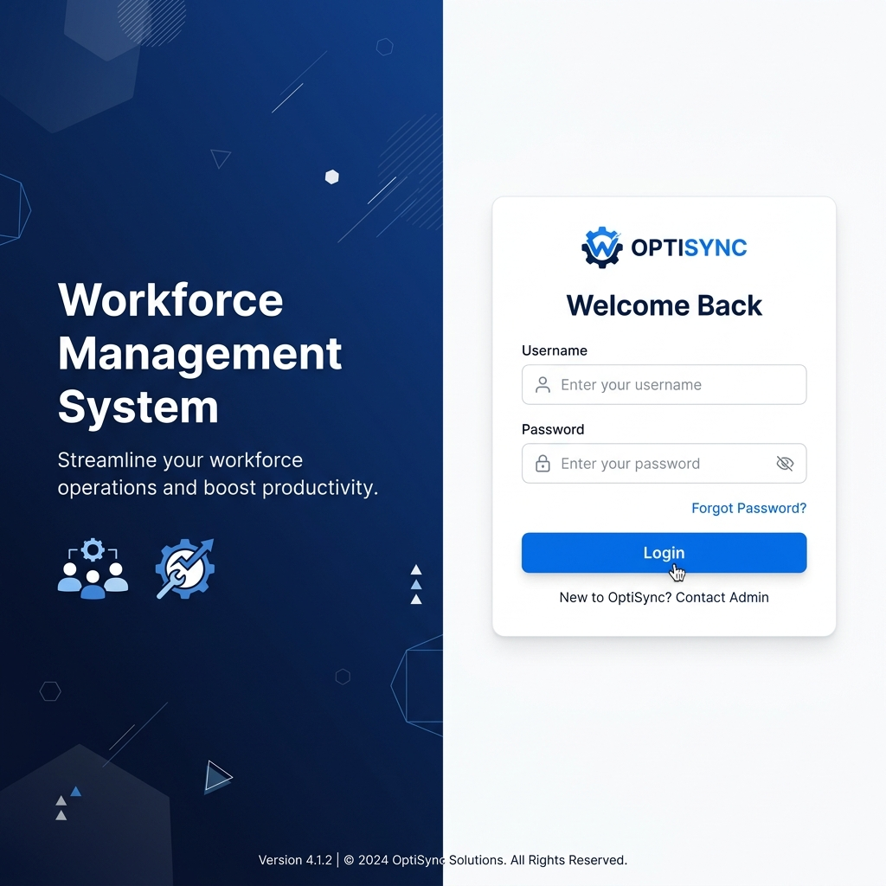
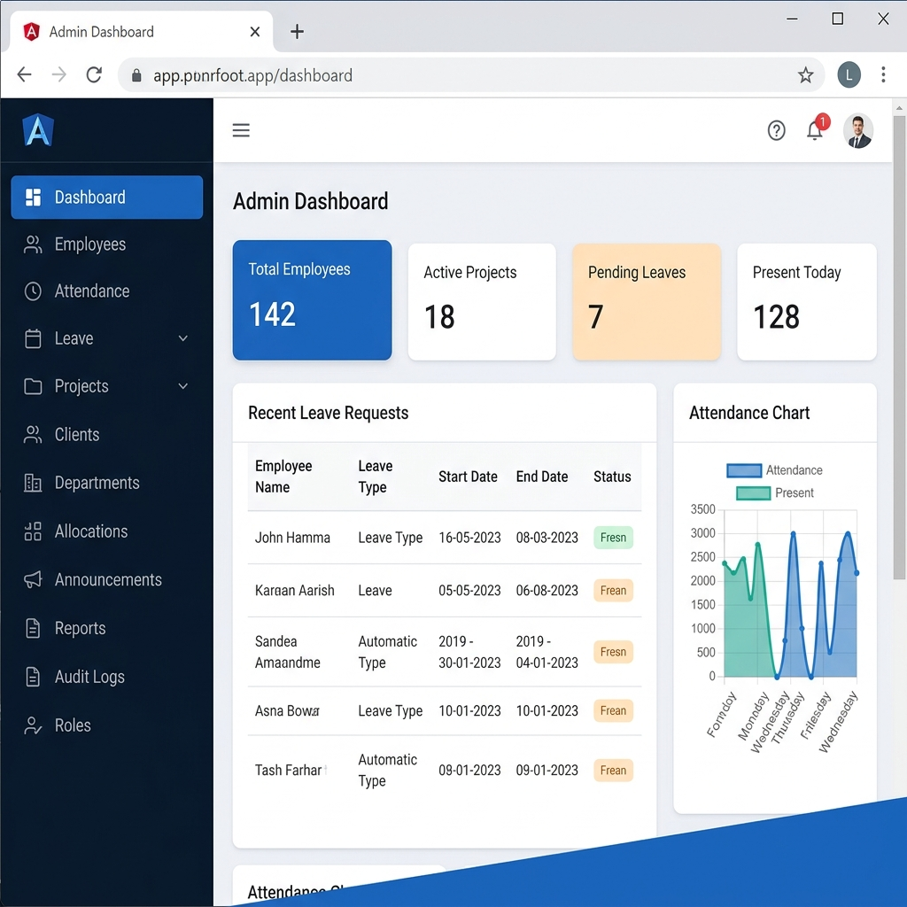
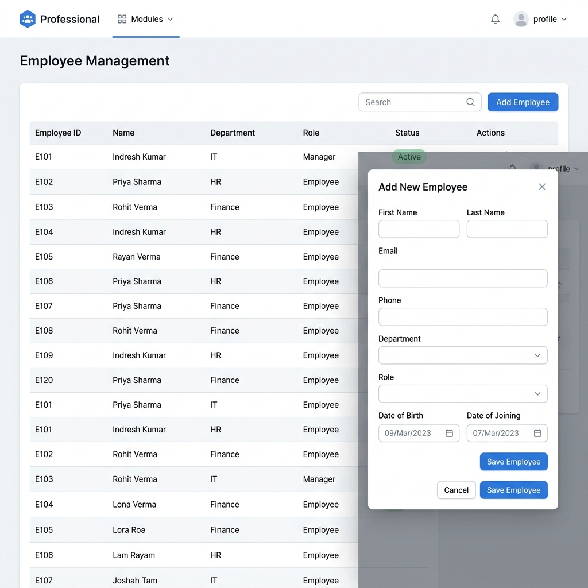
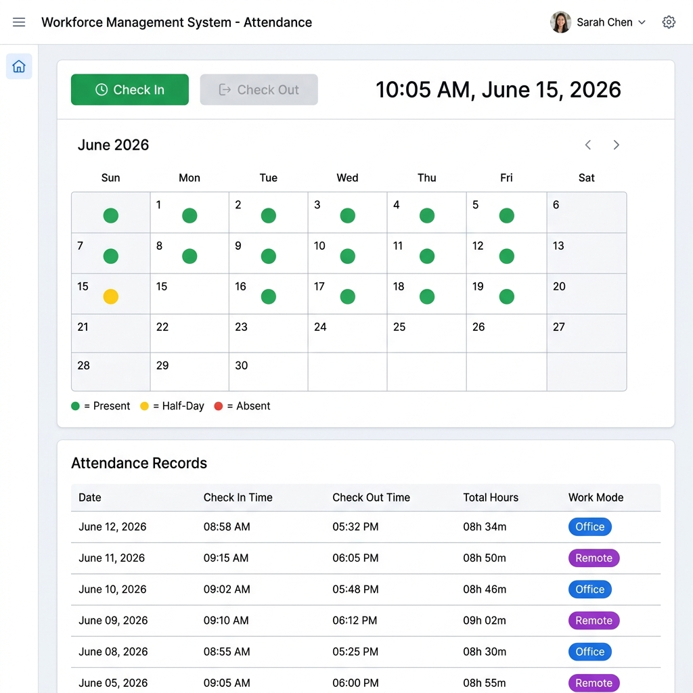
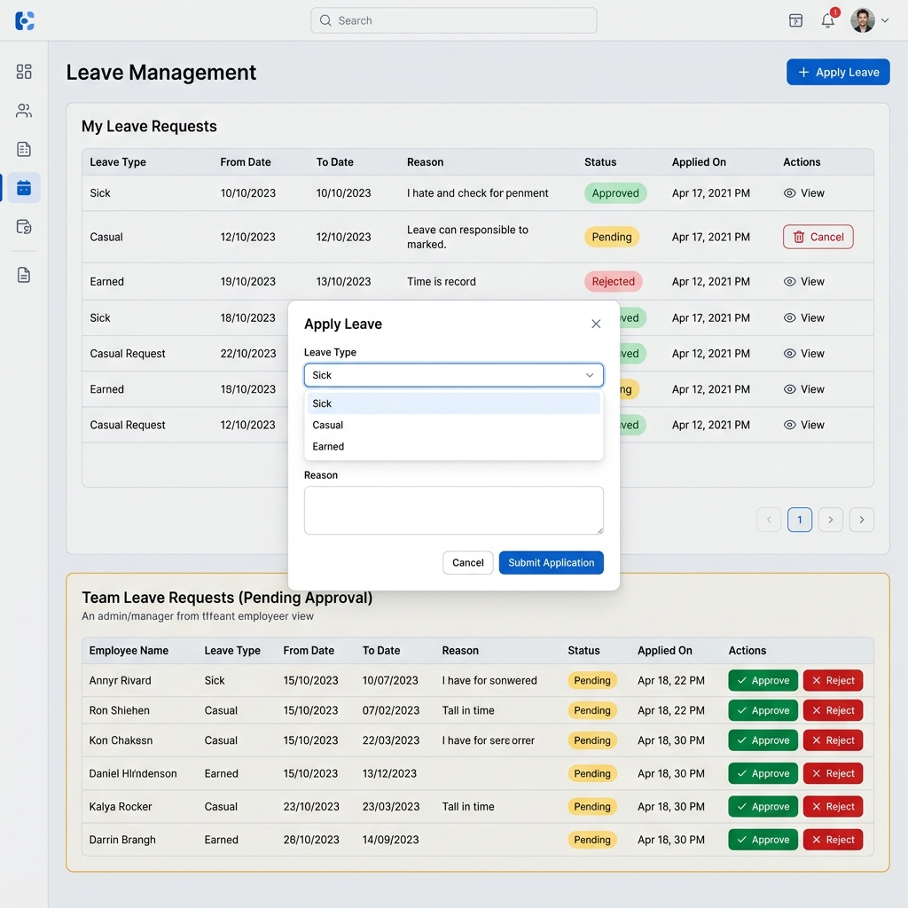

# Workforce Management System (WMS)

> A full-stack enterprise Workforce Management System built with **ASP.NET Core 8** and **Angular 21**, following **Clean Architecture** principles and deployed to **Azure**.

---

## What is This?

The Workforce Management System is a web application I built to handle the day-to-day HR and workforce operations that every organization needs — tracking employees, managing attendance, processing leave requests, allocating people to projects, posting announcements, and generating reports. Everything is secured with role-based access control, so Admins, Managers, and Employees each see only what they need and can do only what they're allowed to.

---

## What Each Role Can Do

**Admin** is the superuser. They can create and manage employees, departments, clients, projects, and roles. They allocate employees to projects, post announcements, export reports as Excel files, and review the full audit log. The only thing Admin can't do is apply for leave — there's nobody above them to approve it.

**Manager** can view employee lists (read-only), check in and out for attendance, apply for leave, and approve or reject leave for their team members. They can see projects and allocations relevant to their teams.

**Employee** can check in and out daily, apply for and cancel their own leave, view their project allocations, read announcements, and manage their profile. First-time users are required to change their default password before accessing the system.

---

## Tech Stack

### Backend
- **ASP.NET Core 8 Web API** — RESTful API with JWT authentication
- **Entity Framework Core 8** — ORM for database access
- **SQL Server / Azure SQL** — Relational database
- **BCrypt.Net** — Password hashing
- **EPPlus** — Excel report generation
- **Swagger / OpenAPI** — API documentation

### Frontend
- **Angular 21** — Standalone components (no NgModule)
- **TypeScript 5.9** — Type-safe frontend code
- **Angular Signals** — Reactive state management
- **SCSS + CSS Custom Properties** — Theming and design system
- **Vitest** — Unit testing

### DevOps
- **Azure DevOps Pipelines** — CI/CD automation
- **Azure App Service** — Backend hosting
- **Azure SQL Database** — Production database
- **Git** — Version control

---

## Project Structure

```
WMS-Solution/
├── WMS.API/                    # ASP.NET Core Web API (Controllers, DI, Middleware)
├── WMS.Application/            # Business Logic (Services, DTOs, Validation)
├── WMS.Domain/                 # Core Entities & Repository Interfaces (no dependencies)
├── WMS.Infrastructure/         # EF Core Repositories, DbContext, JWT Service, Migrations
├── WMS.Frontend/               # Angular 21 SPA (Components, Services, Guards)
├── WMS.Tests/                  # Backend Unit Tests (Service layer)
├── WMS.DevOps/                 # Azure CI/CD Pipeline Definition
└── docs/                       # HLD & LLD Documentation
```

The backend follows **Clean Architecture** — four layers where each depends only on the layer inside it. Domain has zero external dependencies, Application contains business logic, Infrastructure handles database access and external services, and API is the thin HTTP entry point.

---

## Getting Started

### Prerequisites

- [.NET 8 SDK](https://dotnet.microsoft.com/download/dotnet/8.0)
- [Node.js 20+](https://nodejs.org/) with npm
- [SQL Server](https://www.microsoft.com/en-us/sql-server) (local instance or Azure SQL)
- [Angular CLI](https://angular.dev/tools/cli) v21

### 1. Clone and Configure

```bash
git clone <repository-url>
cd WMS-Solution
```

Edit `WMS.API/appsettings.Development.json` with your database connection string and JWT settings:

```json
{
  "ConnectionStrings": {
    "DefaultConnection": "Server=<your-server>;Initial Catalog=WMSDatabase;..."
  },
  "Jwt": {
    "Key": "<your-secret-key-min-32-chars>",
    "Issuer": "WMSAPI",
    "Audience": "WMSClient"
  },
  "EmployeeOnboarding": {
    "DefaultPassword": "WMS@Start2026!"
  }
}
```

### 2. Set Up the Database

```bash
cd WMS.API
dotnet ef database update
```

On first run, the database seeder automatically creates a default Admin account:
- **Username:** `admin`
- **Password:** `Admin@123`

### 3. Start the Backend

```bash
cd WMS.API
dotnet run
```

The API starts at `http://localhost:5198`. Swagger UI is available at `/swagger`.

### 4. Start the Frontend

```bash
cd WMS.Frontend
npm install
npm start
```

The Angular app starts at `http://localhost:4200`. It uses a proxy configuration (`proxy.conf.json`) to forward all `/api` requests to the backend at `localhost:5198`, so you don't need to worry about CORS during development.

### 5. Log In

Open `http://localhost:4200` in your browser. Log in with `admin` / `Admin@123`. From the Admin dashboard, you can create employees, departments, and start using all features.

---

## How Frontend and Backend Communicate

### Locally (Development)

The Angular dev server runs on port 4200, and the .NET API runs on port 5198. The frontend's `environment.ts` sets the API URL to just `/api` (relative). Angular's dev server proxy (`proxy.conf.json`) intercepts requests matching `/api` and forwards them to `http://localhost:5198`. This way, the frontend code doesn't hardcode the backend's port.

The `authInterceptor` (registered in `app.config.ts`) automatically attaches the JWT token from localStorage to every outgoing request, and handles 401 responses by redirecting to the login page.

### On Azure (Production)

The backend deploys to Azure App Service (`wms-api-indresh-2026`), connected to Azure SQL Database. The frontend's `environment.prod.ts` sets the API URL to the full Azure URL (`https://wms-api-indresh-2026-....azurewebsites.net/api`). In production, the frontend talks directly to the backend over HTTPS — no proxy needed. CORS is configured on the backend to allow the frontend's domain.

The CI/CD pipeline in `WMS.DevOps/.azure-pipelines.yml` automatically builds and deploys the backend on every push to `main`.

---

## Authentication

The system uses JWT Bearer Tokens. On login, the backend validates credentials with BCrypt, generates a signed JWT with user claims (UserId, Username, Role, EmployeeId), and returns it. The Angular app stores the token in localStorage and attaches it to every subsequent request.

**Default Credentials:**

| Role | Username | Password |
|---|---|---|
| Admin | `admin` | `Admin@123` |
| New Employee/Manager | (created by Admin) | `WMS@Start2026!` (must change on first login) |

---

## API Endpoints

| Area | Key Endpoints | Access |
|---|---|---|
| Auth | `POST /api/auth/login`, `POST /api/auth/change-password` | Login is anonymous; rest need JWT |
| Employee | `GET/POST/PUT/DELETE /api/employee` | Admin creates; Admin+Manager view |
| Attendance | `POST /api/attendance/checkin`, `POST /api/attendance/checkout` | All authenticated users |
| Leave | `POST /api/leave/apply`, `POST /api/leave/approve/{id}` | Employees apply; Admin+Manager approve |
| Project | `GET/POST/PUT/DELETE /api/project` | Admin manages; all view |
| Allocation | `POST /api/allocation` | Admin allocates; all view own |
| Dashboard | `GET /api/dashboard/admin\|manager\|employee` | Role-specific endpoints |
| Report | `GET /api/report/export/{type}` | Admin only (Excel download) |

Full endpoint documentation is available in the [LLD](docs/LLD.md) or via Swagger UI at `/swagger`.

---

## Running Tests

```bash
# Backend unit tests
cd WMS.Tests
dotnet test

# Frontend tests
cd WMS.Frontend
npm test
```

Backend tests focus on the service layer with mocked repositories. Frontend tests verify component rendering and service HTTP calls.

---

## Documentation

| Document | What It Covers |
|---|---|
| [HLD.md](docs/HLD.md) | Architecture overview, component flows, how frontend and backend communicate, deployment setup, security design |
| [LLD.md](docs/LLD.md) | Entity schemas, repository contracts, service logic step-by-step, DTO shapes, API endpoint details, frontend internals, testing strategy |

---

## Screenshots

### Login Page


### Admin Dashboard


### Employee Management


### Attendance Tracking


### Leave Management


---

## Author

**Indresh** — Full-Stack Developer  
Built as a comprehensive enterprise WMS solution using modern web technologies.

---

## License

This project is private and proprietary. All rights reserved.
