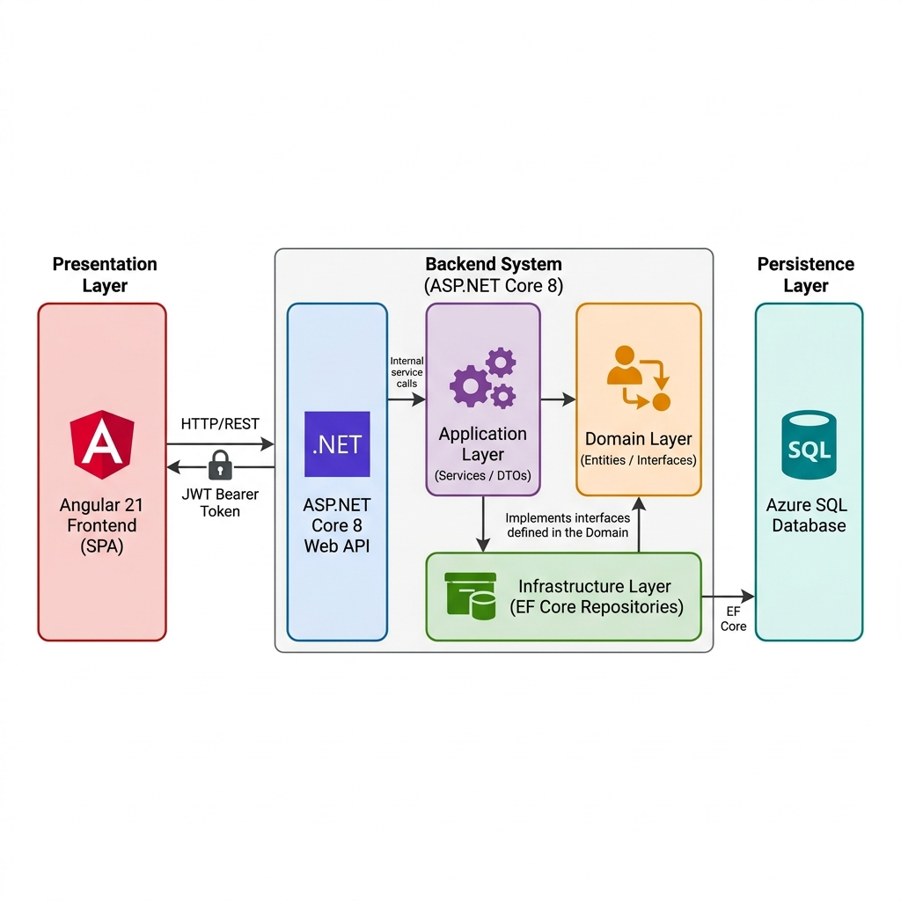

# High-Level Design (HLD) — Workforce Management System

**Document Version:** 2.0  
**Date:** June 2026  
**Author:** Indresh  
**Project:** WMS-Solution

---

## 1. Executive Summary

The Workforce Management System (WMS) is something I built to solve a real-world problem — managing HR and workforce operations in a single, cohesive platform. Instead of juggling spreadsheets for attendance, emails for leave requests, and separate tools for project tracking, WMS brings everything under one roof.

It's a full-stack web application where Admins can manage the entire organization, Managers can oversee their teams, and Employees can handle their own attendance, leave, and profile — all through a clean, role-aware interface. The backend runs on ASP.NET Core 8, the frontend is Angular 21, and the whole thing is deployed to Azure with a CI/CD pipeline that pushes changes automatically on every commit to `main`.

---

## 2. What the System Does

At its core, WMS handles these operational areas:

- **Employee Management** — Admin creates and manages employee records, assigns departments and roles. When a new employee is added, the system automatically generates a login account for them with a default password.

- **Attendance Tracking** — Every user (Admin, Manager, Employee) can check in and check out daily. The system records the exact timestamps, calculates total working hours, and tracks whether the person worked from the Office or Remote.

- **Leave Management** — Employees and Managers apply for leave. Managers approve or reject leave for their team members. Admins can approve or reject anyone's leave. The entire lifecycle — apply, approve, reject, cancel — is tracked with timestamps and the ID of whoever took the action.

- **Project and Client Management** — Admin registers clients, creates projects linked to those clients, and assigns a Manager to each project. Then employees get allocated to projects. This creates a clear chain: Client → Project → Manager → Allocated Employees.

- **Announcements** — Admin posts company-wide announcements. Everyone can read them. Old announcements can be deactivated.

- **Reports** — Admin can export data (employees, attendance, leave, projects) as Excel (.xlsx) files for offline analysis.

- **Audit Trail** — Every important action (creating an employee, approving a leave, deleting a project) gets logged with who did it and when. Admin can review the full audit log.

- **Role-Based Dashboards** — Each role sees a different dashboard. Admin sees organization-wide stats (total employees, active projects, pending leaves, today's attendance). Manager sees team-specific stats. Employee sees their own attendance, leave balance, projects, and announcements.

---

## 3. How the System is Architected

### The Big Picture

There are two main parts to this system, and they talk to each other over HTTP:

**The Frontend** is an Angular 21 Single Page Application. It runs in the user's browser. When you open the app, Angular takes over — it handles navigation between pages, manages the UI state, and makes HTTP calls to the backend whenever it needs data or wants to perform an action.

**The Backend** is an ASP.NET Core 8 Web API. It doesn't serve any HTML — it purely exposes RESTful endpoints that return JSON. It handles authentication, enforces authorization, runs all the business logic, and talks to the database.

**The Database** is a SQL Server instance (Azure SQL when deployed, local SQL Server during development). It stores all the persistent data — employees, attendance records, leaves, projects, everything. The backend manages the database through Entity Framework Core, which means I work with C# objects and LINQ queries instead of writing raw SQL.

### How the Backend is Layered (Clean Architecture)

The backend isn't one big monolith — it's split into four separate .NET projects, each with a clear responsibility. I followed Clean Architecture (sometimes called Onion Architecture) so that the core business logic doesn't depend on external frameworks or databases.

**WMS.Domain** — This is the innermost layer, the heart of the application. It contains two things: the entity classes (Employee, Attendance, Leave, Project, etc.) and the repository interfaces (like `IEmployeeRepository`, `ILeaveRepository`). This project has zero NuGet package references — it's pure C#. It doesn't know about Entity Framework, doesn't know about HTTP, doesn't know about JWT tokens. It just defines what the business objects look like and what operations should exist.

**WMS.Application** — This layer sits on top of Domain. It contains all the business logic as services. For example, `EmployeeService` knows how to create an employee — it validates the data, creates the Employee record, auto-generates a UserLogin with a hashed default password, and logs the action to the audit trail. This layer also defines DTOs (Data Transfer Objects) — separate classes for what comes in from the API (`CreateEmployeeDto`) and what goes out to the client (`EmployeeResponseDto`). The service interfaces and their implementations live here. Each service depends on repository interfaces from the Domain layer, not on concrete implementations.

**WMS.Infrastructure** — This is where the real-world integrations live. It implements all the repository interfaces using Entity Framework Core. For example, `EmployeeRepository` implements `IEmployeeRepository` and uses `WmsDbContext` to actually query SQL Server. The `WmsDbContext` is configured here with all entity relationships, table mappings, and seed data. The JWT token generation service (`JwtService`) also lives here because it depends on external libraries for cryptography. Database migrations are stored here too.

**WMS.API** — This is the outermost layer, the entry point. It has the `Program.cs` file that wires everything together — registering services in the DI container, configuring JWT authentication, setting up CORS, enabling Swagger. It also contains all the Controllers — thin classes that receive HTTP requests, extract claims from the JWT token, call the appropriate service, and return the response. Controllers don't contain business logic; they delegate everything to the Application layer.

**The key rule**: each layer only depends on the layer directly inside it. Controllers depend on Application services. Application services depend on Domain interfaces. Infrastructure implements those interfaces. Domain depends on nothing.

---

## 4. The Flow of a Request Through the Backend

To make this concrete, let me walk through what happens when someone creates a new employee. This same pattern applies to almost every feature in the system.

### Step 1 — The HTTP Request Arrives at the Controller

An Admin clicks "Add Employee" on the Angular frontend. The frontend sends a `POST` request to `/api/employee` with a JSON body containing the employee details. The request includes a JWT token in the `Authorization` header.

The request first hits the ASP.NET Core middleware pipeline defined in `Program.cs`. The CORS middleware checks that the request origin is allowed. Then the JWT authentication middleware validates the token — it checks the signature, issuer, audience, and expiry. If the token is valid, it extracts the claims (UserId, Username, Role, EmployeeId) and attaches them to the `HttpContext.User`.

The request reaches `EmployeeController`. The `[Authorize(Roles = "Admin")]` attribute on the `Create` method verifies that the user's role claim is "Admin". If not, ASP.NET Core returns a 403 Forbidden before the method even executes.

### Step 2 — The Controller Delegates to the Service

Inside the controller method, I extract the `UserId` from the JWT claims (using `User.FindFirst(ClaimTypes.NameIdentifier)`). Then I call `_employeeService.CreateAsync(userId, dto)` — passing along both the actor's identity and the incoming DTO.

The controller doesn't validate business rules, doesn't talk to the database, doesn't hash passwords. It just bridges the HTTP world to the service layer.

### Step 3 — The Service Executes Business Logic

`EmployeeService.CreateAsync` is where the real work happens. It takes the `CreateEmployeeDto`, maps it to an `Employee` entity, and calls the repository to persist it. But it does more than just save data:

1. It creates the `Employee` record through `IEmployeeRepository.CreateAsync(employee)`.
2. It auto-generates a `UserLogin` for the new employee — username is typically the email, and the password is a default value from configuration (`WMS@Start2026!`), hashed with BCrypt.
3. It logs the action to the audit trail by calling `IAuditLogRepository` — recording that this specific user created an employee record at this timestamp.
4. It returns an `EmployeeResponseDto` — a flattened, UI-friendly version of the employee data with the department name and role name resolved.

### Step 4 — The Repository Talks to the Database

When the service calls `IEmployeeRepository.CreateAsync(employee)`, the actual implementation in `WMS.Infrastructure` takes over. `EmployeeRepository` uses `WmsDbContext` (Entity Framework Core) to add the entity to the `DbSet<Employee>` and call `SaveChangesAsync()`. EF Core translates this into an `INSERT` SQL statement and executes it against the database.

The repository also handles eager loading (using `.Include()`) when retrieving data — so when you fetch an employee, the related Department and Role objects come along in a single query.

### Step 5 — The Response Goes Back

The DTO flows back up: Repository → Service → Controller → HTTP Response. The controller wraps it in `Ok(result)` (HTTP 200) and ASP.NET Core serializes the DTO to JSON and sends it back to the frontend.

---

## 5. How DTOs Work in This System

DTOs (Data Transfer Objects) are the contract between the API and the outside world. I don't expose my domain entities directly because:

- Entities have navigation properties and internal fields that clients shouldn't see.
- The shape of data that comes *in* (for creating/updating) is different from what goes *out* (response data).
- DTOs let me control exactly what information crosses the wire.

For each major feature, there are typically three types of DTOs:

- **CreateDto** — What the frontend sends when creating a record. For example, `CreateEmployeeDto` includes `FirstName`, `LastName`, `Email`, `DepartmentId`, `RoleId`, etc. It doesn't include `EmployeeId` (auto-generated) or `CreatedOn` (set by the server).

- **UpdateDto** — What the frontend sends when editing. It's similar to CreateDto but may include different fields (like `Status`).

- **ResponseDto** — What the API returns. For example, `EmployeeResponseDto` includes resolved names like `DepartmentName` and `RoleName` instead of just IDs, plus formatted fields that the UI can display directly.

All DTOs live in `WMS.Application/DTOs/`, organized by feature (e.g., `DTOs/Employee/`, `DTOs/Leave/`, `DTOs/Attendance/`).

---

## 6. How Repositories Work

Repositories are the gateway to the database. Each entity (or closely related group of entities) has its own repository interface in `WMS.Domain/Interfaces/` and a concrete implementation in `WMS.Infrastructure/Repositories/`.

Here's the full list of repositories and what they handle:

- **IEmployeeRepository / EmployeeRepository** — CRUD for employees, search by name, filter by department or role, lookup by userId.
- **IAuthRepository / AuthRepository** — Finding UserLogin records for authentication, creating login accounts, updating passwords.
- **IAttendanceRepository / AttendanceRepository** — Creating check-in records, updating on check-out, fetching today's record, monthly history.
- **ILeaveRepository / LeaveRepository** — Creating leave applications, fetching pending leaves, filtering by employee or manager scope.
- **IProjectRepository / ProjectRepository** — CRUD for projects, filtering by manager.
- **IClientRepository / ClientRepository** — CRUD for clients.
- **IDepartmentRepository / DepartmentRepository** — CRUD for departments, search.
- **IRoleRepository / RoleRepository** — Fetching available roles, creating custom roles.
- **IEmployeeProjectRepository / EmployeeProjectRepository** — Allocating and releasing employees from projects, fetching allocations by project or employee.
- **IAnnouncementRepository / AnnouncementRepository** — CRUD for announcements.
- **IAuditLogRepository / AuditLogRepository** — Writing audit entries, fetching logs with filtering.

Every repository follows the same structural pattern: constructor receives `WmsDbContext` via dependency injection, methods use LINQ with `.Include()` for eager loading, and all operations are async.

---

## 7. How Controllers Are Organized

The API has 14 controllers, each mapped to a specific feature area. They all follow the same conventions:

- Decorated with `[ApiController]` and `[Route("api/[controller]")]`.
- Class-level `[Authorize]` ensures all endpoints require authentication.
- Method-level `[Authorize(Roles = "...")]` restricts access by role.
- Controllers extract the user's identity from JWT claims when needed (e.g., to pass `userId` to services for audit logging).
- They return standard HTTP responses: `Ok()` for success, `NotFound()` when a record doesn't exist, `NoContent()` for successful updates/deletes, `BadRequest()` for validation failures.

Here's what each controller handles:

**AuthController** (`/api/auth`) — Login (anonymous), fetch profile, change password.  
**EmployeeController** (`/api/employee`) — Full CRUD, search, filter by department/role, "get my profile".  
**AttendanceController** (`/api/attendance`) — Check-in, check-out, my attendance history, monthly view.  
**LeaveController** (`/api/leave`) — Apply, cancel, view my leaves, view pending (role-scoped), approve, reject.  
**ProjectController** (`/api/project`) — CRUD, manager's own projects view.  
**AllocationController** (`/api/allocation`) — Allocate/release employees, view by project or employee.  
**DepartmentController** (`/api/department`) — CRUD, search.  
**ClientController** (`/api/client`) — CRUD.  
**AnnouncementController** (`/api/announcement`) — CRUD, everyone can read, Admin can write.  
**DashboardController** (`/api/dashboard`) — Three endpoints, one per role (admin/manager/employee), each returning role-specific aggregated stats.  
**ReportController** (`/api/report`) — Excel export for various report types.  
**AuditLogController** (`/api/auditlog`) — View audit trail with filtering.  
**RoleController** (`/api/role`) — View and manage system roles.  
**ProfileController** (`/api/profile`) — View and update own profile, change password.

---

## 8. Key Business Flows Explained

### 8.1 Authentication — How a User Logs In

When a user opens the app and submits the login form, the Angular `AuthService` sends a `POST` to `/api/auth/login` with `{username, password}`. This is the only endpoint that doesn't require a JWT token.

On the backend, `AuthController` calls `AuthService.LoginAsync()`. The service looks up the `UserLogin` record by username, then uses BCrypt to compare the submitted password against the stored hash. If it matches, the service calls `JwtService.GenerateToken()` — which creates a JWT token containing four claims: UserId, Username, Role, and EmployeeId. The token is signed with an HMAC-SHA256 key from configuration and has a configurable expiry.

The response includes the token, role, userId, employeeId, and a flag indicating whether this is the user's first login. Angular receives this, stores the entire response in `localStorage` as `wms_session`, and updates the reactive `currentUser` signal. From this point on, the HTTP interceptor automatically attaches the token to every outgoing request.

If it's the user's first login (they're using the default password), the `authGuard` detects the `isFirstLogin` flag and redirects them to the Change Password page before they can access anything else.

### 8.2 Attendance — Check-In and Check-Out

When an employee clicks "Check In", the Angular `AttendanceService` sends a `POST` to `/api/attendance/checkin` with `{workMode: "Office"}` (or "Remote"). The backend extracts the employee's ID from the JWT claims — the employee doesn't need to specify who they are; the token carries their identity.

The `AttendanceService` on the backend first checks if there's already an open attendance record for today. If the employee has already checked in and hasn't checked out, it throws an exception with a clear error message. Otherwise, it creates a new `Attendance` record with the current timestamp as `CheckIn` and today's date as `AttendanceDate`.

Check-out works similarly — it finds today's open record, sets `CheckOut` to the current time, and calculates `TotalHours` as the difference between check-out and check-in.

Managers and Admins can also view any employee's attendance history. The frontend sends a `GET` request with the employee ID in the URL, and the backend returns the filtered records.

### 8.3 Leave — Apply, Approve, Reject

An Employee or Manager fills out the leave form (type, dates, reason) and submits it. The Angular `LeaveService` sends a `POST` to `/api/leave/apply`. The backend creates a `Leave` record with `Status = "Pending"`.

Now the leave is visible in the "Pending Leaves" list. For a Manager, `GET /api/leave/pending` returns only leaves from employees who are allocated to the manager's projects (team-scoped). For an Admin, it returns all pending leaves across the organization.

When a Manager or Admin clicks "Approve" or "Reject", the frontend sends a `POST` to `/api/leave/approve/{id}` or `/api/leave/reject/{id}`. The backend updates the leave status, records who approved/rejected it and when, and creates an audit log entry.

An employee can also cancel their own pending leave — `DELETE /api/leave/cancel/{id}` — but only if it hasn't already been approved or rejected.

### 8.4 Project Allocation — Connecting Employees to Projects

This is a three-step process:

1. Admin creates a **Client** — the external organization (`POST /api/client`).
2. Admin creates a **Project** linked to that client and assigns a Manager (`POST /api/project`).
3. Admin **allocates** employees to the project (`POST /api/allocation` with `{employeeId, projectId}`).

Under the hood, allocation creates an `EmployeeProject` record — a join table that links employees to projects with an allocation date and optional release date.

Employees can view their own allocations (`GET /api/allocation/my-projects`), Managers can see allocations for their projects, and Admin can see everything.

---

## 9. Role-Based Access Control (RBAC)

The system has three roles, each with different levels of access:

**Admin** has full control over everything — employee CRUD, department management, client management, project management, allocations, announcements, role management, audit logs, and report generation. Admin is the only role that can see audit logs and export reports. Admins do not apply for leave — they're excluded from the leave workflow since there's no one above them to approve.

**Manager** can view employee lists (read-only), manage attendance (their own), apply for and have leave approved/rejected, view projects, see team-level allocations, and read announcements. Managers can approve or reject leave for employees on their team.

**Employee** can manage their own attendance (check-in/check-out), apply for leave, view their own project allocations, read announcements, and manage their profile. They can't see other employees' data or access administrative features.

This is enforced at two levels:
1. **Backend** — Every controller method has `[Authorize(Roles = "...")]` attributes. Even if someone crafts a direct API request, the middleware blocks unauthorized access.
2. **Frontend** — Angular's `roleGuard` checks the user's role before allowing navigation to a page. The sidebar menu dynamically shows/hides items based on the logged-in user's role.

---

## 10. Security Design

Security isn't bolted on as an afterthought — it's built into every layer:

**Passwords** are never stored in plaintext. When a user is created, the default password is hashed with BCrypt before storage. When a user logs in, BCrypt compares the submitted password against the stored hash. Even if someone gets access to the database, they can't reverse the hashes.

**JWT Tokens** are the backbone of authentication. The token is signed with an HMAC-SHA256 key that's stored in `appsettings.json` (and in Azure App Service configuration for production). The backend validates the token's signature, issuer, audience, and expiry on every request. Token claims carry the user's identity (UserId, Username, Role, EmployeeId), so the backend always knows who's making the request without needing a session.

**CORS Policy** controls which origins can talk to the API. In development, it's configured to allow Angular's dev server. In production, it's scoped to the deployed frontend domain.

**First Login Enforcement** — When an employee is created, they get a default password. The system flags their account as `isFirstLogin`. The auth guard on the frontend forces them to change their password before they can use any feature.

**API Protection** — Every endpoint except `/api/auth/login` requires a valid JWT token. Swagger UI is configured with Bearer token support so developers can test authenticated endpoints during development.

---

## 11. Database Design — How the Data Relates

The database has 11 tables, and their relationships tell the story of the system:

**Roles** defines the three system roles (Admin, Manager, Employee). This table is seeded on first run — you don't create roles manually.

**Departments** represents organizational departments (IT, HR, Finance are seeded). Admin can add more.

**Employees** is the central table. Every employee belongs to a Department (via `DepartmentId`) and has a Role (via `RoleId`). An employee has a status (Active/Inactive), personal details, and timestamps.

**UserLogins** is the authentication table. Each UserLogin maps to an Employee (via `EmployeeId`) — except for the seed Admin account which doesn't have an employee record. UserLogin stores the username, BCrypt-hashed password, and role reference.

**Attendances** records daily check-in/check-out events. Each record links to an Employee, stores the check-in and check-out timestamps, total hours worked, work mode, and date.

**Leaves** tracks leave applications. Each leave belongs to an Employee and has a type (Sick, Casual, Earned), date range, status (Pending, Approved, Rejected), and optionally the ID of the manager who approved or rejected it.

**Clients** stores external client organizations.

**Projects** links to a Client and a Manager (who is an Employee with the Manager role). Each project has a status and date range.

**EmployeeProjects** is the many-to-many join table between Employees and Projects. This is the "allocation" — an employee gets allocated to a project on a specific date and optionally released later.

**Announcements** stores company-wide messages, linked to the UserLogin of whoever created them.

**AuditLogs** captures every create/update/delete action, linked to the UserLogin of the actor.

---

## 12. How the Frontend is Structured

### Architecture Overview

The Angular 21 frontend uses standalone components (no NgModules). The application is organized into four main areas:

**core/** — This is the shared foundation that the entire app depends on. It contains:
- **constants/** — `api.constants.ts` defines all API endpoint strings as a centralized object. No component ever hardcodes a URL.
- **guards/** — `auth.guard.ts` (checks if the user has a valid session) and `role.guard.ts` (checks if the user's role matches the route's required roles).
- **interceptors/** — `auth.interceptor.ts` automatically attaches the JWT token to every HTTP request and handles 401 errors by redirecting to login.
- **models/** — `wms.models.ts` defines TypeScript interfaces that mirror the backend's DTOs — ensuring type safety across the frontend.
- **services/** — 14 service classes, one per feature. Each service encapsulates all HTTP calls to its corresponding backend controller.

**features/** — 15 feature directories, one per page. Each directory contains a standalone page component (`*.page.ts`) with its template and styles. Features include: auth (login + change-password), dashboard, employee, attendance, leave, project, allocation, department, client, announcement, report, audit-log, role, profile, and system (forbidden + unauthorized pages).

**layouts/** — The `AppShellComponent` that provides the application shell — a sidebar for navigation and a header showing the current user's info. The sidebar dynamically renders menu items based on the user's role. All authenticated pages render inside this shell's `<router-outlet>`.

**shared/** — Reusable UI components (buttons, modals, data tables, etc.) used across feature pages.

### How Angular Services Map to Backend Controllers

There's a near-perfect 1:1 mapping between Angular services and backend controllers. For example:

- `EmployeeService` → `EmployeeController` (calls `/api/employee/*`)
- `AttendanceService` → `AttendanceController` (calls `/api/attendance/*`)
- `LeaveService` → `LeaveController` (calls `/api/leave/*`)
- `DashboardService` → `DashboardController` (calls `/api/dashboard/*`)

Each Angular service is an `@Injectable({ providedIn: 'root' })` singleton. It injects `HttpClient`, constructs the full URL using `environment.apiUrl` + the constant from `ApiEndpoints`, and returns an `Observable` from the HTTP call. The page components subscribe to these observables and update their local state (using Angular Signals) when the response arrives.

### How Routing and Guards Protect Pages

The routing configuration in `app.routes.ts` defines every page and its access rules:

- The `/login` route is unprotected — anyone can access it.
- Every other route is a child of the `AppShellComponent` route, which is protected by `authGuard`.
- Individual feature routes additionally use `roleGuard` with a `data.roles` array specifying which roles can access that page.

When a user navigates to a page, Angular's router runs the guards *before* loading the component. If `authGuard` fails (no valid session), the user is redirected to `/login` with a `returnUrl` query parameter so they come back after logging in. If `roleGuard` fails (wrong role), they're redirected to `/forbidden`.

### State Management with Signals

The app uses Angular Signals for reactive state. The primary signal is `AuthService.currentUser` — a `signal<LoginResponse | null>` that the entire app reads to determine if the user is logged in, what their role is, and their display name. When this signal changes (login, logout, session restore), any component reading it automatically updates.

### Design System

The frontend uses SCSS with CSS Custom Properties for theming. The design system defines colors, spacing, typography, and transitions as CSS variables on `:root`. A `[data-theme='dark']` selector overrides these variables for dark mode support. This means switching between light and dark mode only requires toggling a data attribute — no component changes needed.

---

## 13. How Frontend and Backend Communicate

### On Your Local Machine (Development)

During development, the frontend and backend run as two separate processes on different ports:

- **Angular dev server** runs at `http://localhost:4200` (started with `npm start` or `ng serve`).
- **ASP.NET Core API** runs at `http://localhost:5198` (started with `dotnet run`).

The frontend's `environment.ts` sets `apiUrl: '/api'` — notice it's a relative path, not a full URL. So when the Angular `EmployeeService` calls `this.http.get('/api/employee')`, the browser would normally send this request to `localhost:4200/api/employee`, which is the Angular dev server — not the backend.

This is where the **Angular proxy** comes in. The `proxy.conf.json` file tells Angular's dev server: "Any request starting with `/api` should be forwarded to `http://localhost:5198`." So the request transparently passes through:

1. Angular component calls `EmployeeService.getAll()`.
2. `EmployeeService` sends `GET http://localhost:4200/api/employee`.
3. Angular's dev server proxy intercepts the `/api` prefix.
4. Proxy forwards the request to `http://localhost:5198/api/employee`.
5. ASP.NET Core processes it and returns JSON.
6. Proxy passes the response back to the Angular app.
7. The component receives the data and updates the UI.

The developer never notices the proxy — it's seamless. The benefit is that the frontend code doesn't hardcode the backend URL, so the same code works in production without changes.

On the backend side, `Program.cs` configures CORS with `AllowAnyOrigin()` during development, so the API accepts requests from any origin.

### On Azure (Production Deployment)

In production, the setup is different because the frontend and backend run on separate Azure services:

**Backend** is deployed to **Azure App Service** (`wms-api-indresh-2026`). It runs as a .NET 8 web app and connects to **Azure SQL Database** (`WMSDatabase`). The connection string, JWT key, and other secrets are configured as Application Settings in the Azure portal — they override `appsettings.Production.json` at runtime.

**Frontend** is built with `ng build --configuration=production`, which compiles Angular into static files (HTML, JS, CSS) in the `dist/` directory. The production environment file (`environment.prod.ts`) sets `apiUrl` to the full Azure backend URL: `https://wms-api-indresh-2026-gte3b6hnh0cvcxan.southeastasia-01.azurewebsites.net/api`.

So in production, the communication flow changes:

1. The user's browser loads the Angular SPA (static files served from wherever the frontend is hosted).
2. Angular component calls `EmployeeService.getAll()`.
3. `EmployeeService` sends `GET https://wms-api-indresh-2026-....azurewebsites.net/api/employee`.
4. The request goes directly to Azure App Service over HTTPS.
5. The `authInterceptor` has already attached the JWT token to the `Authorization` header.
6. Azure App Service runs the ASP.NET Core pipeline — CORS check, JWT validation, routing, controller, service, repository, database query.
7. The JSON response travels back over HTTPS to the browser.
8. Angular receives it and updates the UI.

There's no proxy in production — the frontend talks directly to the backend's public URL. CORS is configured on the backend to allow the frontend's deployed domain.

### The Role of the HTTP Interceptor in Both Environments

The `authInterceptor` (registered in `app.config.ts`) sits between Angular's HTTP client and the network. On every outgoing request:

1. It reads the `currentUser` signal from `AuthService`.
2. If the user is logged in and has a token, it clones the request and adds `Authorization: Bearer <token>` to the headers.
3. On the response side, if any non-login request gets a 401 (token expired or invalid), the interceptor automatically logs the user out and redirects them to the login page with a `sessionExpired` flag.

This means individual services and components never worry about authentication — the interceptor handles it transparently.

---

## 14. How the CI/CD Pipeline Works

The project uses Azure DevOps Pipelines to automate deployment. The pipeline is defined in `WMS.DevOps/.azure-pipelines.yml` and triggers on every push to the `main` branch.

The pipeline has two stages:

**Stage 1 — Build Backend**: The pipeline runs on a `windows-latest` agent. It installs .NET 8 SDK, restores NuGet packages, builds the `WMS.API` project in Release configuration, and publishes the output to an artifact directory. The artifact is named `api`.

**Stage 2 — Deploy Backend**: This stage only runs if the build succeeded. It downloads the `api` artifact from Stage 1 and deploys it to Azure App Service (`wms-api-indresh-2026`) using MSDeploy via the `AzureRmWebAppDeployment` task. The deployment uses an Azure Service Connection (`Azure-ServiceConnection`) for authentication.

Currently, only the backend is deployed through the pipeline. The frontend is built and deployed separately.

---

## 15. How Tests Are Structured

### Backend Tests (WMS.Tests)

The test project `WMS.Tests` focuses on service-layer unit tests. Tests are organized under `Services/` with subdirectories per feature:

- **Auth/** — Tests for login validation, password hashing, token generation.
- **Attendance/** — Tests for check-in/check-out logic, duplicate check-in prevention, hours calculation.
- **Leave/** — Tests for leave application, approval/rejection rules, cancellation constraints.
- **Dashboard/** — Tests for aggregation logic per role.

Each test mocks the repository interfaces (using a mocking framework) and verifies that the service methods produce the correct behavior. For example, a test might verify that `CheckInAsync` throws an exception if the employee already has an open attendance record for today.

### Frontend Tests

The Angular frontend uses Vitest as its test runner. Component tests verify that pages render correctly, services return expected observables, and guards behave properly for different role configurations.

---

## 16. Non-Functional Requirements

**Scalability** — The API is stateless (all state is in the JWT token and the database), which means you can run multiple instances behind a load balancer without worrying about session affinity. Azure App Service supports auto-scaling based on CPU/memory.

**Maintainability** — Clean Architecture ensures that changing the database (e.g., switching from SQL Server to PostgreSQL) only requires changes in the Infrastructure layer. Business logic stays untouched. Dependency injection means every component is loosely coupled and can be swapped.

**Testability** — Because services depend on interfaces (not concrete classes), every service can be unit-tested with mocked dependencies. No database needed for unit tests.

**Security** — BCrypt for passwords, JWT for authentication, role-based authorization at both the API and UI level. The audit log creates a paper trail for accountability.

**Observability** — The AuditLog entity captures every mutating operation with the actor's identity and timestamp. Admins can review the full history of actions taken in the system.

**Portability** — EF Core migrations manage the database schema, and environment-specific `appsettings` files handle configuration differences between local development and Azure deployment.

---

## 17. Screenshots

### System Architecture Diagram

### Admin Dashboard (Role-specific data aggregation)

### Login Page (JWT-secured entry point)

---

*Document prepared as part of WMS Solution documentation suite.*
